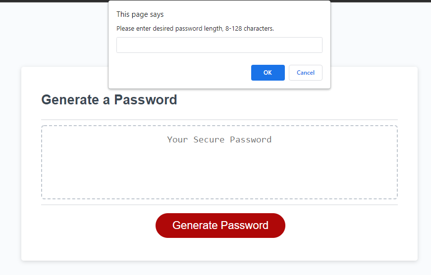

# Password-Generator

## Description
I built this password generator because cybersecurity is extremely important but often overlooked, and one of the most important parts of cybersecurity is having a good password. However, it can be hard to constantly come up with new secure passwords, so this application does it for you. For this project, I had HTML and CSS provided to me, as well as a few lines of starting JavaScript. I wrote the rest of the JavaScript.

In building this project, I learned about the power of JavaScript. Responding to a user's input is a very important aspect of JavaScript, and building this application taught me an effective way to do it. I also gained experience in using JavaScript to randomize something, which is a useful tool.

Link to deployed application: https://gjguerin96.github.io/Password-Generator/

## Usage
This application has a "Generate Password" button that the user can click, which will cause a series of 5 dialog boxes to pop up and request a user input (see screenshot). Once the user has responded to all 5, their new password will appear in the "Your Secure Password" box. If they are not happy with their password, they can simply generate another password until they are satisfied.

    
## Credits
I recieved some assistance and advice from my tutor, Vinnie Lopez. I also talked with my roommate about the best way to randomize something in Javascript.

## License
Copyright (c) 2021 Gabriel Guerin

Permission is hereby granted, free of charge, to any person obtaining a copy of this software and associated documentation files (the "Software"), to deal in the Software without restriction, including without limitation the rights to use, copy, modify, merge, publish, distribute, sublicense, and/or sell copies of the Software, and to permit persons to whom the Software is furnished to do so, subject to the following conditions:

The above copyright notice and this permission notice shall be included in all copies or substantial portions of the Software.

THE SOFTWARE IS PROVIDED "AS IS", WITHOUT WARRANTY OF ANY KIND, EXPRESS OR IMPLIED, INCLUDING BUT NOT LIMITED TO THE WARRANTIES OF MERCHANTABILITY, FITNESS FOR A PARTICULAR PURPOSE AND NONINFRINGEMENT. IN NO EVENT SHALL THE AUTHORS OR COPYRIGHT HOLDERS BE LIABLE FOR ANY CLAIM, DAMAGES OR OTHER LIABILITY, WHETHER IN AN ACTION OF CONTRACT, TORT OR OTHERWISE, ARISING FROM, OUT OF OR IN CONNECTION WITH THE SOFTWARE OR THE USE OR OTHER DEALINGS IN THE SOFTWARE.
